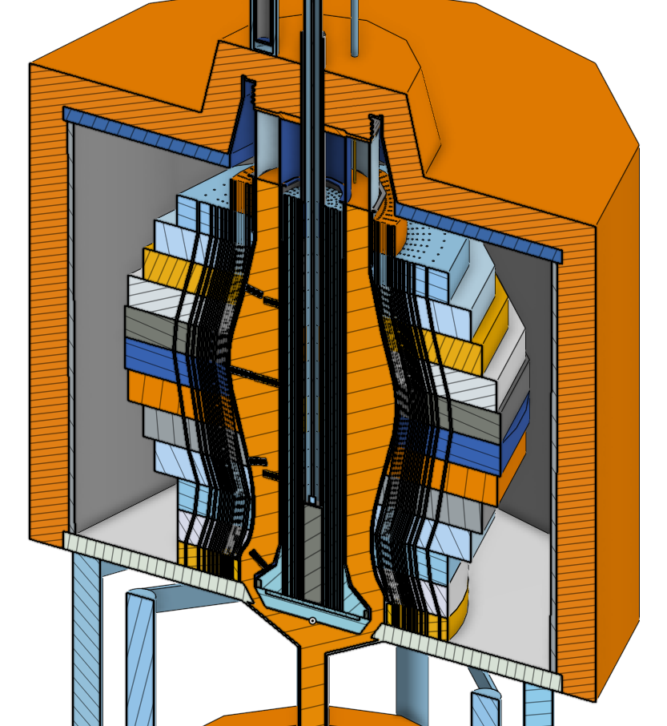

# zpre
detailed cad model and simulations of the [zpre](https://www.osti.gov/servlets/purl/4673343) (zero power reflector-moderated reactor experiment at elevated temperature, sometimes refered to in documentation as the pr-mark I (pratt and whitney mark I).), operated by oak ridge national laboratory 1957

## model

cad model of the are can be found [here](https://cad.onshape.com/documents/c51fcabf7b4a45b5a8d610d5/v/1e941e226a75c4f4f3cbe020/e/4c356de19c02efb455bb582a) on onshape. note, the step files for the simulations (found in the step_files folder) come from the [final_for_export](https://cad.onshape.com/documents/c51fcabf7b4a45b5a8d610d5/w/14e94161170229891d1c18bd/e/4c356de19c02efb455bb582a) branch. currently onshape does not properly export enclosed volumes, so some parts need to be modified in order to be meshed properly

### zpre core 


## prerequisites 
### cad_to_h5m
python package used to automate cubit-dagmc workflow for creating h5m files. these scripts use the [material_tag](https://github.com/openmsr/cad_to_h5m/tree/material_tag) branch 

### cubit
cubit is required to convert the cad model (.step) into a .h5m file readable by openmc, using the [cad_to_h5m](https://github.com/openmsr/cad_to_h5m/tree/material_tag) package. the step_to_h5m folder contains the necessary scripts for these examples. if your cubit installation is somewhere other than `/opt/Coreform-Cubit-2021.5/bin/`, you will need to update the `local_cubit_path` variable in the step_to_h5m scripts

### openmc
these simulations use [openmc](https://docs.openmc.org/en/stable/). automated source installation scripts for linux can be found [here](https://github.com/openmsr/openmc_install_scripts)

## simulation guide

first, clone the repository

```
git clone https://github.com/openmsr/are.git
```

enter the are folder and run the `run.sh` script

```
cd zpre
./run.sh
```
